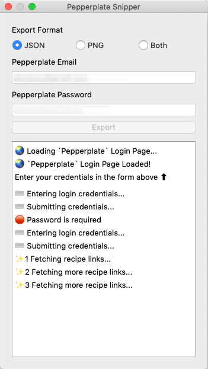
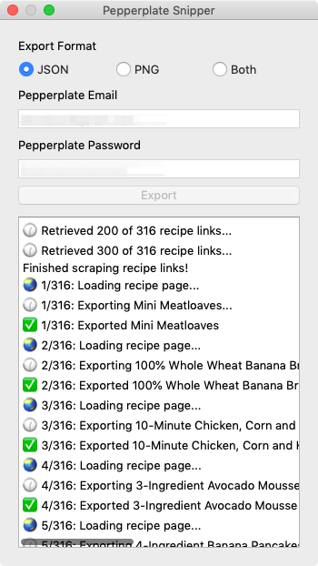

**The Pepperplate Snipper** exports recipes in your Pepperplate account as JSON and/or PNG screenshots.

Recipes are exported to your home folder **`~/Pepperplate`**


## Sample Recipe Screenshot


## Sample JSON
<details>
<summary>Click to expand</summary>

```json
{
   "title": "3-Ingredient Avocado Mousse",
   "source": "",
   "description": "Avocado Mousse | 3 Delicious Ways",
   "yield": "1",
   "active_time": "",
   "total_time": "",
   "categories": "dessert",
   "ingredients": [
      {
         "group_name": "Chocolate Avocado Mousse",
         "list": [
            {
               "quantity": "1",
               "item": "avocado"
            },
            {
               "quantity": "2",
               "item": "tbsp agave syrup"
            },
            {
               "quantity": "2",
               "item": "tbsp vegan cocoa powder"
            }
         ]
      },
      {
         "group_name": "Blackberry Avocado Mousse",
         "list": [
            {
               "quantity": "1",
               "item": "avocado"
            },
            {
               "quantity": "2",
               "item": "tbsp cup agave syrup"
            },
            {
               "quantity": "1/4",
               "item": "cup blackberries"
            }
         ]
      },
      {
         "group_name": "Lime Avocado Mousse",
         "list": [
            {
               "quantity": "1",
               "item": "avocado"
            },
            {
               "quantity": "2",
               "item": "tbsp cup agave syrup"
            },
            {
               "quantity": "1",
               "item": "lime, juiced and zested"
            }
         ]
      }
   ],
   "instructions": [
      {
         "group_name": "",
         "steps": [
            "Combine ingredients in a food processor and pulse until completely smooth; about 1-2 minutes.",
            "Enjoy!"
         ]
      }
   ],
   "notes": "",
   "image": ""
}
```

</details>

## The App

 

Built with


